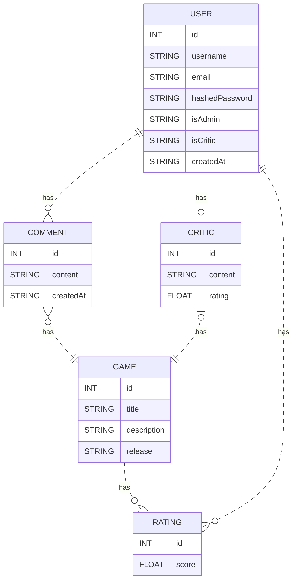

# Modelo de Dados

### Modelo Entidade-Relacionamento (MER) - Mermaid

```mermaid
    erDiagram
            USER ||..o{ COMMENT : has
            COMMENT o{ ..|| GAME : has
            GAME || ..o{ RATING : has
            USER || ..o{ RATING : has
            USER || ..o| CRITIC : has
            CRITIC |o ..|| GAME : has
            
            USER {
            INT id
            STRING username
            STRING email
            STRING hashedPassword
            STRING isAdmin
            STRING isCritic
            STRING createdAt
            }
            COMMENT {
                INT id
                STRING content
                STRING createdAt
            }
            GAME{
                INT id
                STRING title
                STRING description
                STRING release
            }
            RATING{
                INT id
                FLOAT score
            }
            CRITIC {
                INT id
                STRING content
                FLOAT rating
            }
```
